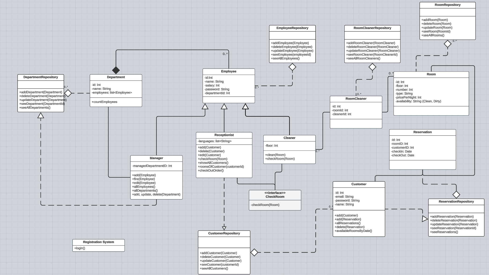

Die Anwendung ist benutzerfreundlich sowohl fur Klienten des Hotels, als auch, 
insbesondere, fur die Arbeiter des Hotels. Man kann sich entweder als Klient,
als Arbeiter oder als Administrator einloggen.

Ein Klient kann sich ein eigenes Konto erstellen, wo er eigene Daten besitzen wird.
In der Klientenabteilung kann man die momentan freien Zimmer, aber auch zukunftig
freie Zimmer sehen. 

Ein Arbeiter besitzt auch ein eigenes Konto, es gibt aber 3 unterschiedliche Kategorien:
Der Putzer (Cleaner), der die Zimmer glatt und sauber halt.
Der Rezeptionist, der die Klienten behandelt.
Und der Manager, der alle Arbeiterkategorien behandelt.

Fur den Administrator gibt es nur ein generelles Konto, in dem man sich mit dem
Password HEXA123F! einloggt. Der Administrator entscheidet fur die kurrente Anwendung,
ob Daten im Netzwerk, lokal oder gar nicht gespeichert werden.
Er hat auch die Option, die lokal gespeicherten Daten durch die online gespeicherten Daten
zu ersetzen, und umgekehrt.

