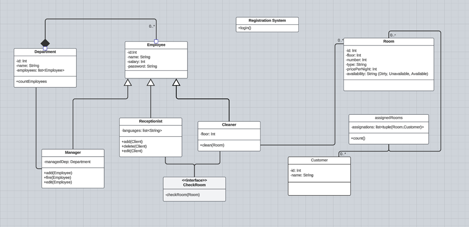

Man fängt von einer Login-Seite an. Hier wird bestimmt, ob der User
ein Manager, ein Cleaner oder ein Receptionist sein wird. Es werden ID
und Password eingegeben. Demfolge wird man zu einer Seite geführt, von
der man bestimmte Aktionen durchführen kann.

Ein Cleaner kann ein Zimmer putzen (ein unsauberes Zimmer kann von Klienten nicht
genommen werden).

Ein Rezeptionist kann die Klienten im System des Hotels mit deren ausgewähltem
Zimmer speichern.

Ein Manager kann Angestellte feuern, deren Attribute ändern oder
mehrere Arbeiter anstellen.

Ein Klient darf mehrere Zimmer renten, damit es für Firmen günstig ist, welche
mehrere Angestellte einbringen wollen. Es können aber auch mehrere Klienten im
selben Zimmer leben. Klienten werden vom Rezeptionisten von der
Aktionen-Seite (nach der Login-Seite) behandelt.

